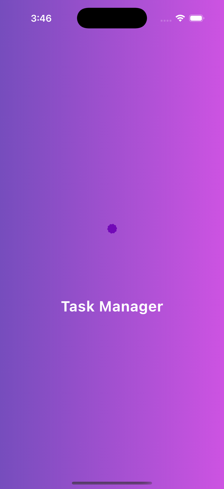
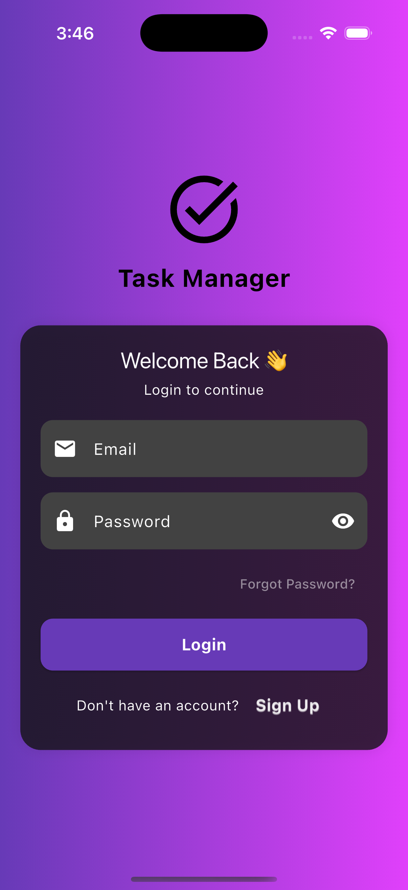
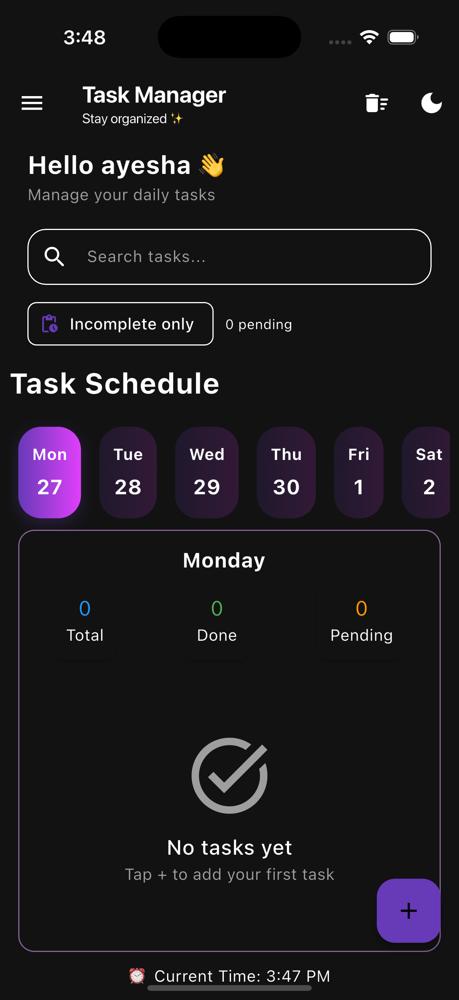
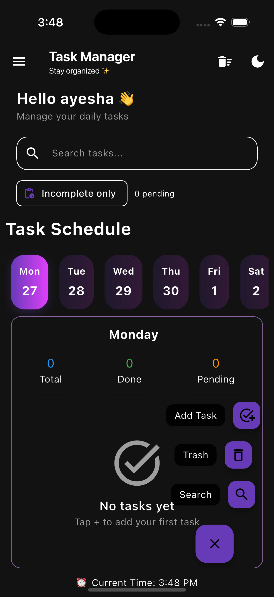
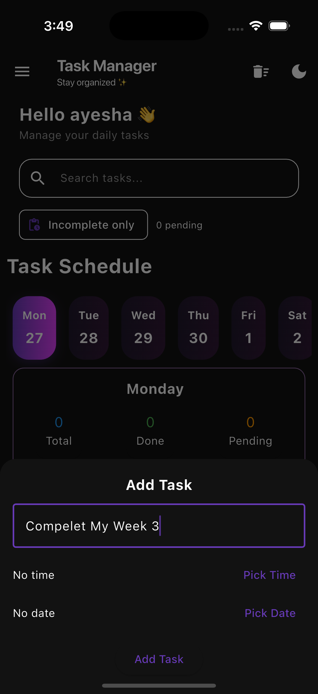
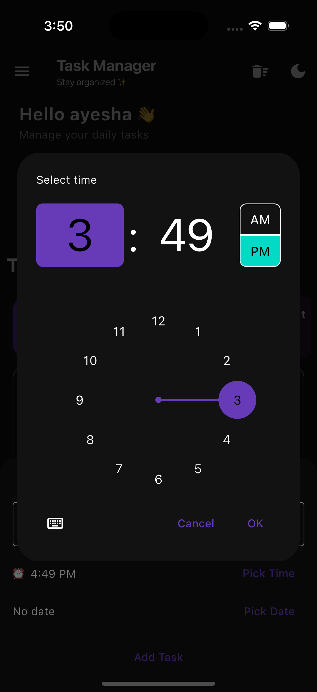

# Week 3 Task Manager

A Flutter task management app with Firebase Authentication, local task persistence, dark/light theme support, and a modern mobile UI.

## Features

- Email/password authentication (Firebase Auth)
- Splash and auth wrapper flow
- Add, edit, complete, delete, and search tasks
- Undo for delete actions
- Theme switch (light/dark) with saved preference
- Local task storage with `SharedPreferences`

## Tech Stack

- `Flutter` / `Dart`
- `firebase_core`
- `firebase_auth`
- `provider`
- `shared_preferences`
- `lottie`

## Project Structure

```text
lib/
  core/
    theme/
    utils/
  data/
    datasource/
    models/
  domain/
    entities/
  presentation/
    screens/
    widgets/
  firebase_options.dart
  main.dart
```

## Prerequisites

Make sure you have installed:

- [Flutter SDK](https://docs.flutter.dev/get-started/install)
- Dart SDK (comes with Flutter)
- Android Studio or Xcode (for emulator/simulator)
- A configured Firebase project

Check setup:

```bash
flutter doctor
```

## Firebase Setup

This project uses Firebase Auth and Firebase Core.

1. Create a Firebase project in [Firebase Console](https://console.firebase.google.com/).
2. Enable **Authentication** and turn on **Email/Password** provider.
3. Configure FlutterFire and generate `firebase_options.dart`:

```bash
dart pub global activate flutterfire_cli
flutterfire configure
```

4. Ensure platform config files are added as needed:
   - Android: `android/app/google-services.json`
   - iOS: `ios/Runner/GoogleService-Info.plist`

> `lib/firebase_options.dart` is already present in this repository.

## Installation & Run

From project root:

```bash
flutter pub get
flutter run
```

## Useful Commands

```bash
flutter analyze
flutter test
```

## What I Used in This Project

- **Architecture style**: simple layered structure (`domain`, `data`, `presentation`)
- **State management**: `Provider` (`ThemeProvider`)
- **Authentication**: Firebase Email/Password Auth
- **Persistence**: local JSON serialization + `SharedPreferences`
- **UI**: Material 3, custom widgets, modal bottom sheets, Lottie splash animation

## Screenshots
## User Interface Layout:
Below is the UI implementation for E-Commerce:
<table>
    <tbody>
        <tr>
            <th colspan="4" align="center">E-Commerce Application Using Flutter</th>
        </tr>
        <tr>
            <td></td>
            <td></td>
            <td></td>
            <td></td>
        </tr>
        <tr>
            <td></td>
            <td></td>
            <td></td>
            <td></td>
        </tr>
        <tr>
            <td></td>
            <td></td>
            <td></td>
            <td></td>
        </tr>
       <tr>
            <td></td>
            <td></td>
            <td></td>
            <td></td>
        </tr>
        <tr>
            <td colspan="4" align="center">
                <a href="https://github.com/R-Rubab/-E-Commerce-App">
                    
                </a>
            </td>
        </tr>
    </tbody>
</table>

<!-- - 
- 
- 
- 
- 
-  -->

## Video
- [Watch Project Demo](screenshots/video.mov)

> Note: Add your media files inside the `screenshots/` folder before pushing to GitHub, otherwise these links will not render.


## App Working (Detailed)

This section explains exactly how the app runs from launch to daily usage.

### 1) App startup flow

1. `main.dart` initializes Flutter bindings.
2. Firebase is initialized using `DefaultFirebaseOptions.currentPlatform`.
3. `ThemeProvider` is injected with `Provider` so theme state is available app-wide.
4. `MaterialApp` starts with `SplashScreen`.

### 2) Splash and authentication flow

1. `SplashScreen` shows a Lottie animation for a short delay.
2. After the delay, it navigates to `AuthWrapper`.
3. `AuthWrapper` listens to `FirebaseAuth.instance.authStateChanges()`.
4. Routing logic:
   - If user is logged in -> open `HomeScreen`
   - If user is not logged in -> open `LoginScreen`

This gives automatic session handling (no manual login check on every open).

### 3) Login and signup working

`LoginScreen` handles both sign-in and registration:

- User enters email and password.
- Form validation checks:
  - Email is not empty and contains `@`
  - Password is not empty and at least 6 chars
- On **Login**:
  - Calls `FirebaseAuth.signInWithEmailAndPassword`
  - On success -> navigates to `HomeScreen`
  - On failure -> shows snackbar error
- On **Sign Up**:
  - Calls `createUserWithEmailAndPassword`
  - Then signs in and opens `HomeScreen`

### 4) Home screen task management flow

`HomeScreen` is the main productivity screen. It supports:

- Add task
- Edit task
- Mark task complete/incomplete
- Delete task (with undo)
- Clear all tasks (with confirmation + undo)
- Search tasks by title
- Basic day schedule UI section

#### Add task working

1. Tap floating action button -> opens add-task bottom sheet.
2. User provides:
   - Task title
   - Time
   - Date
3. App validates required fields.
4. New `TaskModel` is added to in-memory task list.
5. Tasks are saved to local storage.
6. Bottom sheet closes and list refreshes.

#### Edit task working

1. Tap edit icon on a task tile.
2. Bottom sheet opens with current task title.
3. After update, task object is replaced with updated values.
4. Changes are saved to local storage.

#### Complete/pending working

- Tapping checkbox toggles `isDone`.
- UI updates status text and strike-through style.
- Updated state is persisted immediately.

#### Delete task + undo working

- Swipe or tap delete to remove task.
- App shows snackbar with `UNDO`.
- If undone, task is restored at original position.

#### Clear all + undo working

- User taps clear action in app bar.
- Confirmation dialog prevents accidental mass delete.
- On confirm:
  - Current list is backed up in memory
  - All tasks are cleared and saved
  - Snackbar offers `UNDO` to restore backup list

### 5) Local data persistence flow

Storage is handled in `LocalStorage` (`SharedPreferences`):

1. Task list is converted to JSON (`toMap` -> `jsonEncode`).
2. JSON string is saved under key `tasks`.
3. On app open, saved JSON is read and decoded.
4. `TaskModel.fromMap` recreates all tasks.

This ensures tasks stay available after app restart.

### 6) Theme (dark/light) working

Theme state is managed by `ThemeProvider`:

- Reads saved theme value from `SharedPreferences` during provider initialization.
- `toggleTheme(bool)` updates in-memory state + storage.
- `MaterialApp.themeMode` reacts via provider and updates UI instantly.

### 7) Logout working

- Logout button in drawer calls `FirebaseAuth.signOut()`.
- Navigation stack is cleared.
- User is routed back through auth flow and sees `LoginScreen`.

### 8) Core model and layers

- `domain/entities/task.dart`: base `Task` entity
- `data/models/task_model.dart`: serialization model (`toMap`, `fromMap`)
- `data/datasource/local_storage.dart`: persistence adapter
- `presentation/screens/*`: user interface and interaction logic
- `presentation/widgets/task_tile.dart`: reusable task row UI

## Current Status

- Analyzer: no issues
- Tests: passing

## Future Improvements

- Move tasks from local storage to Firestore for cloud sync
- Add due-date reminders and push notifications
- Add full form validation and error states for task creation/edit
- Add more widget and integration tests